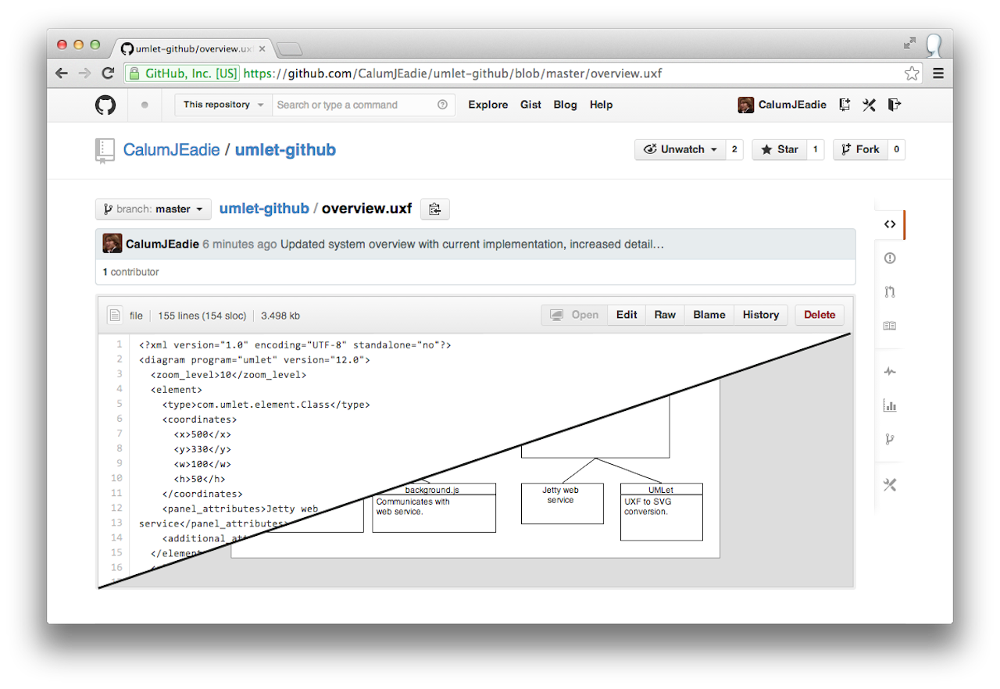
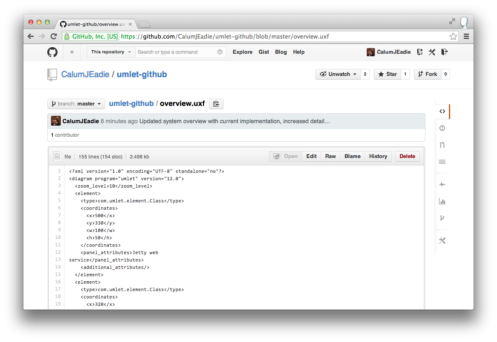
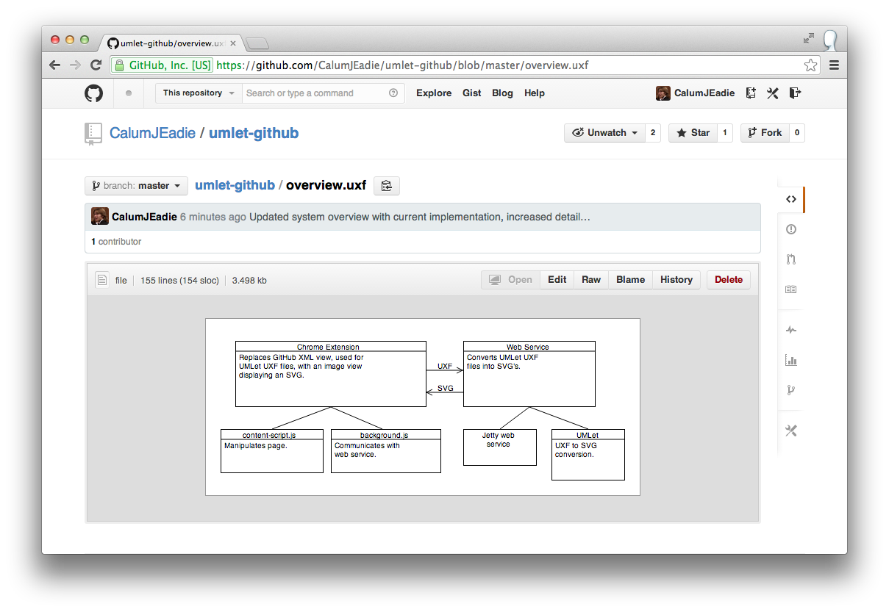
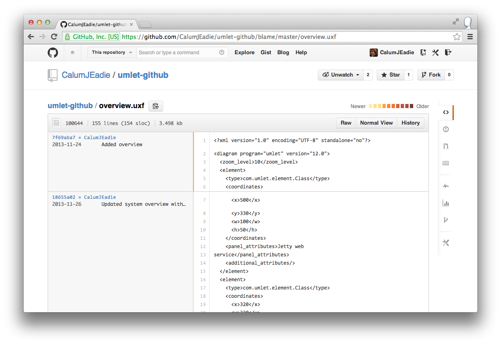
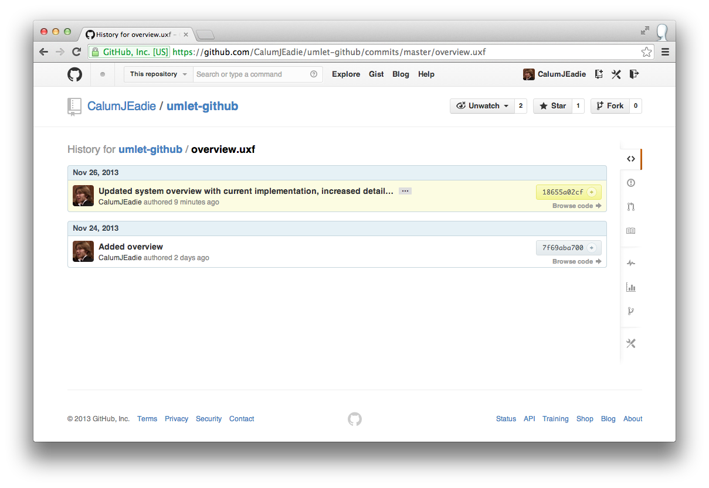

umlet-github
============

[calumjeadie.com](http://www.calumjeadie.com) / [@CalumJEadie](https://twitter.com/CalumJEadie)

View UMLet diagrams within GitHub.



Usage
-----

- Create diagrams using [UMLet](http://www.umlet.com/).
- Install [umlet-github chrome extension](https://chrome.google.com/webstore/detail/umlet-github/paimimbkklhmfcbbgmhpfpjaikijhppl) to view UMLet diagrams

Screenshots
-----------

XML View



SVG View



Git Blame



Git History



Feedback and contributions
--------------------------

Very welcome! I'm [@CalumJEadie](https://twitter.com/CalumJEadie) on Twitter.

Local development
-----------------

To run the web service.

```
mvn package
export PORT=5000
java -cp target/classes:"target/dependency/*" UmletGithub
```

Resources
---------

**Converting from UML to SVG**

umlet-maven-plugin

Maven plugin that converts UMLet diagrams into images for site documentation. Uses UMLet directly to provide UXF to image
conversion.

https://github.com/ykryshchuk/umlet-maven-plugin

**Java on Heroku**

https://devcenter.heroku.com/articles/intro-for-java-developers

https://devcenter.heroku.com/articles/run-non-web-java-processes-on-heroku

https://devcenter.heroku.com/articles/getting-started-with-java

**Communicating with the web service from the chrome extension**

http://developer.chrome.com/extensions/xhr.html

**Communicating between content script and background script**

http://developer.chrome.com/extensions/messaging.html

http://developer.chrome.com/extensions/background_pages.html
